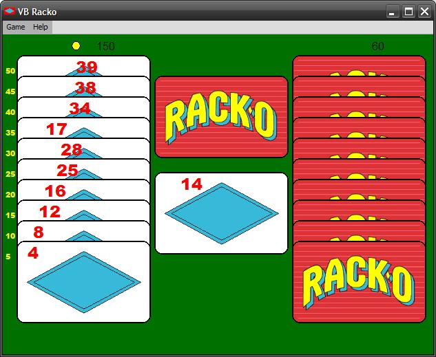



## Racko Card Game

### Description

Racko card game. It's fun! It's addictive! Play against 1, 2 or 3 CPU players. Instructions included in the help chm.

Be first to score 500 points in several rounds of play. Each round, you replace the cards in your rack so their numbers read in any numerical progression from a LOW number at the front to a HIGH number at the back.

[Update Jan 11: Various changes and new features]
 
### More Info
 

             |
---                |---
**Submitted On**   |2011-01-09 08:49:10
**By**             |[Paul Bahlawan](https://github.com/Planet-Source-Code/PSCIndex/blob/master/ByAuthor/paul-bahlawan.md)
**Level**          |Intermediate
**User Rating**    |4.6 (23 globes from 5 users)
**Compatibility**  |VB 6\.0
**Category**       |[Games](https://github.com/Planet-Source-Code/PSCIndex/blob/master/ByCategory/games__1-38.md)
**World**          |[Visual Basic](https://github.com/Planet-Source-Code/PSCIndex/blob/master/ByWorld/visual-basic.md)
**Archive File**   |[Racko\_Card2195851112011\.zip](https://github.com/Planet-Source-Code/paul-bahlawan-racko-card-game__1-73660/archive/master.zip)

